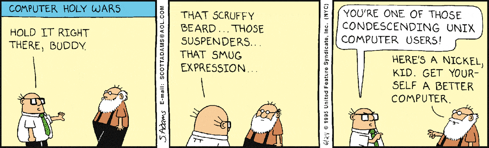
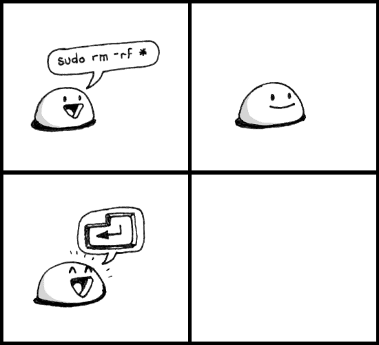
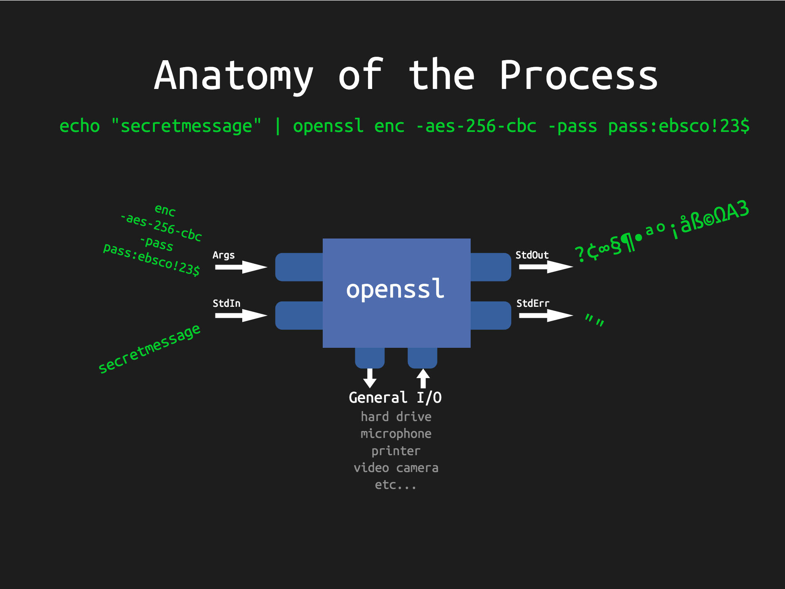
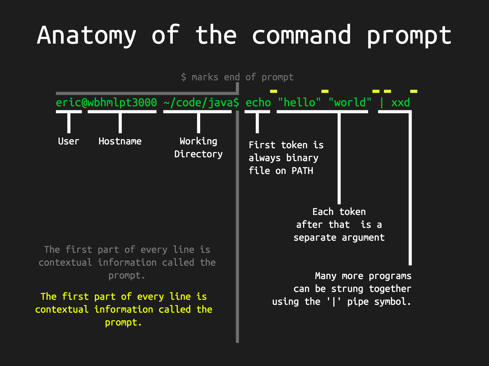
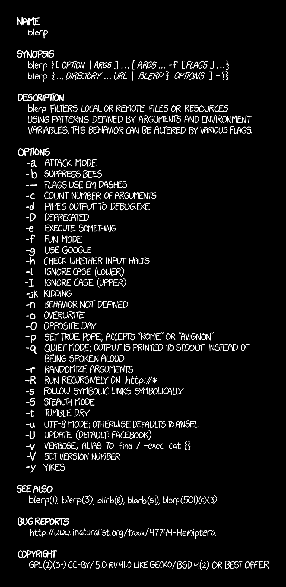
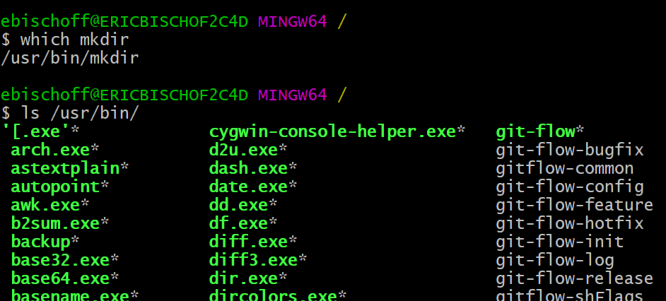
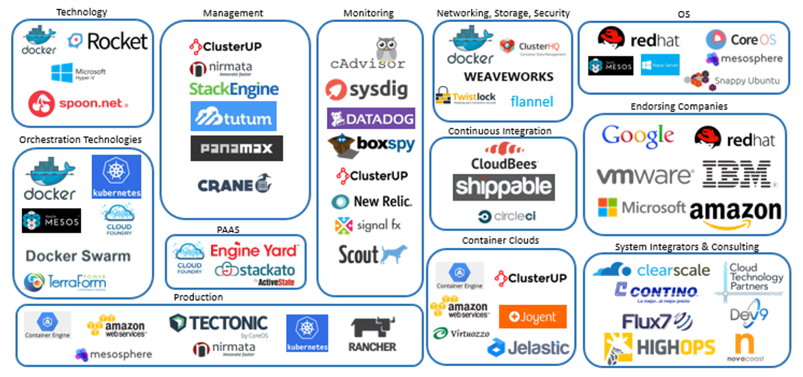

# Unix Command Line Introduction

In this course we will learn the basics of command line while doing a secret communication project in java. 
By the time you've completed this course you will have a better understanding of
why the open source community loves command line,
how to use the unix/linux command line and
how programs work together in command line.

## Flip Crypt Project Overview

The deep state has taken over Ebsco's communication lines. 
We need a way to communicate together without being detected. 
We will build a cryptographic function in Java and use it to communicate secretly
to each other over the network. 
A cryptographic function is a special function that takes two input and one scrambled output.

## Why use CLI and Unix?

Maybe you've had an experience similar to this...



Why do so many grey beards love unix?



1. Scriptable Control over inputs and outputs.

  a. Programs can talk to eachother via stdin and stdout
  
  
  
2. Every input / output has to have a name and human understandable encoding.

  

3. Clean API and Documentation. Has uniform language.

  

4. Programs are binary only. One file.

  

5. Simple is valued above easy.

  

  

6. Choose to share or isolate program environment.

  

## Flip Crypt Project

The deep state has taken over Ebsco's communication lines. 
We need a way to communicate together without being detected.

### 1. Flip Crypt

  Create a command line program called 'flip-crypt' that takes a key as an argument, 
  reads plain text from stdIn and outputs cipher text to stdOut.
  The program will take one character (K) from the key and 
  one character from the plain text (P) then 
  XOR them (K xor P) together to get the cipher character (C).

#### 1.a. Things you may need:

- [Java JDK 8 Download](http://www.oracle.com/technetwork/java/javase/downloads/jdk8-downloads-2133151.html)

  | Commands                  | Action                                         |
  | ------------------------- | --------                                       |
  | ls                        | List files in directory                        |
  | cd < dir >                | Change to directory                            |
  | mkdir < dir >             | Make directory                                 |
  | touch < file >            | Create File or Touch it (update last modified) |
  | emacs < file >            | Open Emacs editor                              |
  | javac < source-files... > | Compile java source files                      |
  | java  < class-files... >  | Run java class file in virtual machine         |

#### 1.b. example bash commands in practice:
  
```bash
cd ~/code/
mkdir flip-crypt
cd flip-crypt
ls                                             #Should be empty.
touch FlipCrypt.java
touch plaintext.txt
emacs FlipCrypt.java                          #Add code from 1c
                                              # You could also use 'notepad' on windows instead of emacs.
emacs plaintext.txt                           #Add your own message
javac FlipCrypt.java
cat plaintext.txt | java FlipCrypt password123 | xxd
```

#### 1.c. FlipCrypt.java Contents
  
```java
import java.io.*;
import java.util.stream.*;
import java.nio.charset.*;

public class FlipCrypt {
	public static void main(String[] args) throws Exception {
		// Err and Exit If No or Short Password
		if (args.length <= 0) {
 			System.err.println("Please Provide a password as an argument");
			return;
		} else if (args[0].length() < 4) {
			System.err.println("Password must be at least 4 characters");
			return;
		}

		// Read Input Message
		ByteArrayOutputStream baos = new ByteArrayOutputStream();
		byte[] buffer = new byte[32 * 1024];
		int bytesRead;
		while ((bytesRead = System.in.read(buffer)) > 0) {
    			baos.write(buffer, 0, bytesRead);
		}
		byte[] message = baos.toByteArray();

		// Read Password
		byte[] password = args[0].getBytes(StandardCharsets.US_ASCII);

		// XOR
		byte[] result = new byte[message.length];
		for (int messageIndex = 0; messageIndex < message.length; messageIndex++) {
			int passwordIndex = messageIndex % (password.length );
			byte P = message[messageIndex];
			byte K = password[passwordIndex];
			byte C = (byte)(P ^ K);
			result[messageIndex] = C;
		}
		
		// Print
		try {
			DataOutputStream dos = new DataOutputStream(System.out);
			dos.write(result, 0, result.length);
			dos.flush();
		} catch (Exception e) {
			e.printStackTrace();
		}
  	}
}
```
    
### 2. Place Flip Crypt in PATH

  The program should be on the PATH so that it can be run as a command line command.
  
#### 2.1. Commands you may need.

  | Commands                  | Action                                              |
  | ------------------------- | --------                                            |
  | export                    | Make variable available to all child processes      |
  | source                    | Make all variables persist outside of child process |
  | mv                        | Move file to location                               |
  | env                       | Show environmental variables                        |
  | sudo                      | Do action as administrator                          |

### 3. Communicate Secretly Over Network

  Use the program to send encrypted and compressed messages directly to a friend over TCP/IP on command line.

#### 3.a. Things you may need.

- [Netcat (Windows Only, comes with Unix)](http://joncraton.org/files/nc111nt.zip)


  | Commands                   | Action                                         |
  | -------------------------  | --------                                       |
  | < prog1 > &#124; < prog2 > | Pipe stdout of < prog1 > to stdin of < prog2 > |
  | nc                         | Opens up TCP socket                            |
  | flip-crypt                 | encrypt or decrypt data                        |
  | gzip                       | compress data                                  |

# 10 Great Commands Per Category

> Should you need a description of any command type `man <command-name>`

> The only exception is for built-in commands, instead use `help <built-in-name>`

| Navigation and Files | Process Management | Information Gathering | Editing   | Network  | Open Source Tools | Compilers Interpreters |
| ----------           | ------------------ | --------------------- | -------   | -------  | ----------------- | ---------              |
| cd                   | ps                 | help                  | ed        | ssh      | git               | javac                  |
| ls                   | kill               | man                   | nano      | curl     | aws               | node                   |
| mkdir                | fg                 | apropos               | **emacs** | wget     | openstack         | python                 |
| touch                | env                | echo                  | **vi**    | ifconfig | docker            | perl                   |
| rm                   | lsof               | cat                   | vim       | netstat  | docker-compose    | clang                  |
| mv                   | tee                | less                  | awk       | nmap     | docker-machine    | clang++                |
| which                | top                | xxd                   | sed       | telnet   | openssl           | cc                     |
| pwd                  | xargs              | objdump               | pico      | nc       | diff2html-cli     | gcc                    |
| chmod                | hup                | type                  | screen    | ettercap | tmux              | go                     |
| sudo                 | cron               | dd                    | hexl      | ngcrack  | npm               | latex                  |

